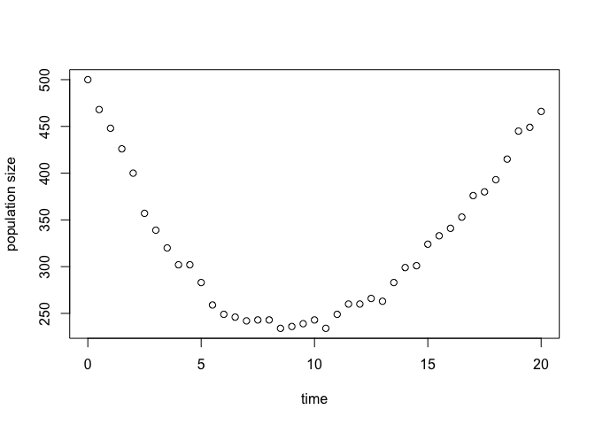

# ESTIpop

ESTIpop is an R-wrapped C++ package to simulate and estimate the
parameters of continuous-time Markov branching processes with
time-dependent rates.

## Installation Notes

### Dependencies

  - [GNU Scientific Library](https://www.gnu.org/software/gsl/)
      - (OSX) brew install gsl with Homebrew or from
        [(http://ftpmirror.gnu.org/gsl/)](http://ftpmirror.gnu.org/gsl/).
      - (Windows) download and extract the file
        [local\#\#\#.zip](http://www.stats.ox.ac.uk/pub/Rtools/goodies/multilib/)
        and create an environmental variable LIB\_GSL to add the
        directory (see notes about Windows installation below for more
        details).
      - (Linux) install libgsl0-dev and gsl-bin.
  - [Rtools](https://cran.r-project.org/bin/windows/Rtools/) (Windows
    only)
  - [devtools](https://github.com/hadley/devtools)

### Important notes about Windows installation

Rtools contains the necessary resources to compile C++ files when
installing packages in R. GSL is also required which can be downloaded
from
[(http://www.stats.ox.ac.uk/pub/Rtools/goodies/multilib/local323.zip)](http://www.stats.ox.ac.uk/pub/Rtools/goodies/multilib/local323.zip).
After downloading, unzip to your R directory. Depending on if your
computer is 32 or 64-bit, move the library files from
local\#\#\#/lib/i386 (32-bit) or local\#\#\#/lib/x64 (64-bit) to
local\#\#\#/lib.

To set the environmental variable LIB\_GSL on a Windows 7/10 computer,
go to “Advanced system settings” in Control Panel \> System and Security
\> System and click Environmental Variables. Create a new system
variable with

  - Variable Name: LIB\_GSL
  - Variable Value: “C:/path/to/local323” (include quotes)

### Recommended R packages

  - ggplot2
  - R.utils

### Installation

To install in R, type:

``` r
install.packages("devtools")
devtools::install_git("https://github.com/Michorlab/estipop.git")
```

## Uses

### Estimation

ESTIpop is an R package that estimates the parameters of continuous-time
Markov branching processes (CTMBPs) with constant or time-dependent
rates. A CTMBP is a stochastic process in which individuals live for a
random amount of time before generating some number of offspring, each
of which continues the process. Individuals can belong to one of a
finite number of types. Each type has its own continuous lifetime
distribution, as well a distirbution that governs the number and types
of offspring it produces. The process is Markov because an individual’s
remaining lifetime is independent of the individual’s age. However, the
rates at which individuals die and reproduce can still vary with time,
analogous to the nature of arrivals in a time-inhomogenous Poisson
process.

### Simulation

ESTIpop also provides methods to simulate continuous-time Markov
branching processes. Simulated processes can have arbitrary numbers of
types and transitions, and may have rates which are constant or
time-dependent.

## Objects in ESTIPop

ESTIpop uses a common representation of branching process models for
simluation and estimation. A branching process model is represented by a
`process_model` object containing one or more `transition` objects, and
each `transition` object is associated with a `rate` object.

### rate Objects

A `rate` object represents the rate at which some event occurs, and may
be a function of time and multiple other parameters. The constructor
`rate(exp)` takes an R expression which describes how the rate depends
on time and other parameters. For example:

``` r
r1 = rate(3.5) # a constant, known rate
r2 = rate(2*t) # a rate which increases linearly with time
r3 = rate(1.5*params[1]) #a rate which depends on one unknown parameter
r4 = rate(params[1] + params[2]*exp(-.5*t)) # a rate which depends on 2 unknown
                                            # parameters and time
```

It is important to note that the variable `t` and the `params` vector
are not variables which we have defined previously in the program. The
`rate` constructor acts on an *expression* which encodes how the rate
evolves with time and various other parameters. We will be able to
evaluate this expression later when we plug in parameter values at a
specific time.

The `rate` constructor expects expressions which conform to the
following subset of the R grammar, and will throw an error at other
inputs.

| Type             | Allowed Symbols            |
| ---------------- | -------------------------- |
| Unary Operators  | \+ - ()                    |
| Binary Operators | \+ - / \* \> \>= \< \<=    |
| Functions        | sin(), cos(), log(), exp() |
| names            | params\[i\], t             |
| numerics         | any scalar numeric value   |

### transition Objects

A `transition` object represents a type of birth or death event which
can occur in the branching process model. A `transition` object has 3
attibutes:

1.  `parent`: The type of the parent which dies and is removed from the
    population when the transition occurs
2.  `offspring`: The number of each type of offspring which are produced
    in the transition. This should be an `d`-length vector where `d` is
    the number of types in the population.
3.  `rate`: A `rate` object (described above) governing how quickly this
    transition occurs

A `transition` object can be constructed as follows:

``` r
r = rate(.5*params[1] + params[2]*exp(-t))
#a type 2 parent dies and produces 2 offspring of different types
trans = transition(rate = r, parent = 1, offspring = (2,0))
```

This transition is illustrated in the following figure:

## process\_model Objects

A `process_model` object is a collection of `transition` objects which
together make up a branching process system. A `process_model` object is
constructed from a sequence of `transition` objects which can occur in
the system. All of the `transition` objects must assume the same number
of types, and the `process_model` constructor will throw an error if
this is not the
case.

``` r
#simple one-type birth death model with rates that decay exponentially over time
birth = rate(params[1]*exp(-params[3]*t))
death = rate(params[2]*exp(-params[3]*t))
model = process_model(transition(rate = birth, parent = 1, offspring = 2),
                      transition(rate = death, parent = 1, offspring = 0))
```

Note that `model` still retains all of the time- and
parameter-dependence of its constituent transitions. Also notice that,
since `params[3]` was used in both the birth and death rate, this model
has the constraint that birth and death rates decay at equal speed.

## Simulation

Armed with a `process_model` object, ESTIpop allows for the simulation
of this system under various parameters values. ESTIpop uses C++ for
high-performance simulation. In the case of time-dependent rates,
ESTIpop parses the expressions and translates them into dynamically
loaded C++ code.

The `branch` function is used to simulate the system specified by a
`process_model` object. It’s parameters are as
follows:

| Argument   | Type                   | Description                                                      | Optional? |
| ---------- | ---------------------- | ---------------------------------------------------------------- | --------- |
| `model`    | `process_model` object | The system to simulate                                           | No        |
| `params`   | numeric vector         | The parameters to plug into the system during simulation         | No        |
| `init_pop` | numeric vector         | The population at the start of the simulation (time 0)           | No        |
| `time_obs` | numeric vector         | The timepoints at which to record the state of the population    | No        |
| `reps`     | numeric scalar         | The number of times to run the simulation                        | No        |
| `silent`   | logical                | Whether to silence intermediate printouts form the C++ simulator | Yes       |
| `keep`     | logical                | Whether to keep logs files from the C++ simulation               | Yes       |
| `seed`     | logical                | A seed for the random number generator                           | Yes       |

The following examples demonstrate ESTIPop’s simulation features:

### One-Type Birth-Death Process

We’ll start by simulation the one-type birth-death model shown in Figure
. In this model, a population of a single type experiences birth events,
in which an individual from the population is chosen to replicate, and
death events, in which an individual from the population is chosen for
removal. To test our estimation procedure, we begin by simulating data
using functions available in ESTIpop. We initiate the population with
size 100 and allow it expand for 5 units of time with birth parameter 1
and death parameter 0.7. Using the following code, we generate 1,000
samples from this process.

``` r
library(estipop)

#Create a one-type birth-death model where the birth rate increases over time
model = process_model(transition(rate = rate(params[1] - params[2]*exp(-params[3]*t)),
                                 parent = 1, offspring = 2),
                      transition(rate = rate(params[4]), parent = 1, offspring = 0))

#Specify the time points at which we will record the state of the simulation
time = seq(0,20,.5)

#The initial size of the simulated population
init_pop = c(500)

#Parameters to plug into the model for this simulation run
params = c(.3,.25,.1, .2)  

#Numer of times to run the simulation
reps <- 1000

res = branch(model = model, params = params, init_pop = init_pop,
             time_obs = time, reps = reps)

#Plot a single replication of the simulation
single <- dplyr::filter(res, rep == 1)
plot(single$time, single$type1, xlab = "time", ylab = "population size")
```

<!-- -->

`res` now contains a dataframe with the result of the simulation. We can
now analyze the results of the simulation.

``` r
res <- dplyr::filter(res, time == 20) #just take the last timepoint
#compute the theoretical moments of the population distribution
mom <- compute_mu_sigma(model, params, 0, 20, init_pop)

print(paste("Sample Mean: ", mean(res$type1)))
```

    ## [1] "Sample Mean:  426.535"

``` r
print(paste("True Mean: ", mom$mu))
```

    ## [1] "True Mean:  425.364259883693"

``` r
print(paste("Sample Variance: ", var(res$type1)))
```

    ## [1] "Sample Variance:  4502.39116616617"

``` r
print(paste("True Variance: ", mom$Sigma))
```

    ## [1] "True Variance:  4386.38004944714"

### Two-Type Birth-Death-Mutation Process

We now consider the two-type process shown in Figure . Here, each of the
two population types has separate birth and death rates, as well a
mutation rate from the type 1 population to the type 2 population. We’ll
again simulate 1000 examples and compare the results with the
theoretical moments.

``` r
library(estipop)

time = 5
init_pop= c(100, 0)

params = c(.4,.1,.7,.1, .3)

#time-homogenous two-type model
model = process_model(transition(rate = rate(params[1]), parent = 1, offspring = c(2,0)),
                      transition(rate = rate(params[2]), parent = 1, offspring = c(0,0)),
                      transition(rate = rate(params[3]), parent = 2, offspring = c(0,2)),
                      transition(rate = rate(params[4]), parent = 2, offspring = c(0,0)),
                      transition(rate = rate(params[5]), parent = 1, offspring = c(1,1)))

res = branch(model, params, init_pop, time, 1000)
```

Now we analyze the simulation results and compare them with theory

``` r
mom = compute_mu_sigma(model, params, 0, 5, init_pop)
print(paste("Sample Mean: ", toString(c(mean(res$type1), mean(res$type2)))))
```

    ## [1] "Sample Mean:  448.151, 1571.425"

``` r
print(paste("True Mean: ", toString(mom$mu)))
```

    ## [1] "True Mean:  448.168943658686, 1560.38542784701"

``` r
print(paste("Sample Variance: ", toString(c(var(res$type1), var(res$type2)))))
```

    ## [1] "Sample Variance:  2756.96316216216, 41241.8542292292"

``` r
print(paste("Sample Covariance:", cov(res$type1, res$type2)))
```

    ## [1] "Sample Covariance: 4801.0769019019"

``` r
print(paste("True Variance: ", toString(diag(mom$Sigma))))
```

    ## [1] "True Variance:  2600.64200784677, 39457.2214316809"

``` r
print(paste("True Covariance: ", toString(mom$Sigma[1,2])))
```

    ## [1] "True Covariance:  4527.31533883025"

## Estimation

Given `process_model` object and a set of datapoints generated from that
model, ESTIpop can estimate the model’s unknown parameter values.

The `estimate` and `estimate_td` functions are used to estimate the
parameters of `process_model` object. The arguments these function as as
follows:

| Argument          | Type                   | Description                                                          |
| ----------------- | ---------------------- | -------------------------------------------------------------------- |
| `model`           | `process_model` object | The system whose parameters are being estimated                      |
| `init_pop`        | `N` x `d` matrix       | The initial population in each of the observations in the dataset    |
| `final_pop`       | `N` x `d` matrix       | The final observed population in each observation                    |
| `start_times`     | `N` x 1 vector         | The time at which each entry in `init_pop` was observed              |
| `end_times`       | `N` x 1 vector         | The time at which each entry in `final_pop` was observed             |
| `initial_ params` | `m` x 1 vector         | The parameter values at which to initialize the estimation procedure |
| `lower`           | `m` x 1 vector         | Lower bounds on each parameter to be estimated                       |
| `upper`           | `m` x 1 vector         | Uppose bounds on each parameter to be estimated                      |
| `trace`           | logical                | Whether to enable output during optimization                         |

The `estimate` function is a wrapper for the `estimate_td` function.
`estimate` only requires the elapsed time between the initial and final
obervations of each entry in the dataset, rather then the exact times of
each observation. `estimate` can be used when the rates of a model do
not depend on time.

The following examples demonstrate ESTIPop’s estimation features:

### Time-dependent one-type model

We now return to the one-type time-dependent model explored in the
simulation section. In this model the birth rate declines as an unknown
exponential function while the death rate remains constant. This could
represent the dynamics of a population recovering from a drug for which
we want to estimate a pharmacokinetic model. First we will simulate the
model, this time with far fewer replications:

``` r
library(estipop)

#Create a one-type birth-death model where the birth rate increases over time
model = process_model(transition(rate = rate(params[1] - params[2]*exp(-params[3]*t)),
                                 parent = 1, offspring = 2),
                      transition(rate = rate(params[4]), parent = 1, offspring = 0))

#Specify the time points at which we will record the state of the simulation
time = seq(0,20,1)

#The initial size of the simulated population
init_pop = c(500)

#Parameters to plug into the model for this simulation run
params = c(.3,.25,.1, .2)  

#Numer of times to run the simulation
reps <- 20

res = branch(model = model, params = params, init_pop = init_pop,
             time_obs = time, reps = reps)
simdat <- format_sim_data(res, ntypes = 1)
```

The last line converts the dataset into the format expected by our
estimation functions. Note that, because the process is Markov, we can
compute the likelihood of the entire dataset by computing the likelihood
of each observation conditioned on the previous observation. We now
estimate the parameters of the model:

``` r
est = estimate_td(model, init_pop = simdat$type1_prev,
                  final_pop =simdat$type1,
                  start_times = simdat$prev_time,
                  end_times = simdat$time,
                  initial = runif(4,0,.5),
                  lower = rep(0,4),
                  upper = rep(.5,4),
                  method = "L-BFGS-B")
```

``` r
print(est$par)
```

    ## [1] 0.2632411 0.2414000 0.1098404 0.1774179

After estimation we recover parameter values very close to ground truth.

### Time-homogenous birth-death-mutation model

We’ll now estimate the parameters of the two-type birth-death-mutation
model we simulated earlier.

``` r
time = seq(0,10,1)
initial = c(100, 0)

params = c(.4,.1,.7,.1, .3)

model = process_model(transition(rate = rate(params[1]), parent = 1, offspring = c(2,0)),
                      transition(rate = rate(params[2]), parent = 1, offspring = c(0,0)),
                      transition(rate = rate(params[3]), parent = 2, offspring = c(0,2)),
                      transition(rate = rate(params[4]), parent = 2, offspring = c(0,0)),
                      transition(rate = rate(params[5]), parent = 1, offspring = c(1,1)))


res = branch(model, params, initial, time, 30)
simdata = format_sim_data(res, model$ntypes)
est = estimate(model, init_pop = cbind(simdata$type1_prev, simdata$type2_prev),
               final_pop = cbind(simdata$type1, simdata$type2),
               times = simdata$dtime,
               initial = runif(5,0,.5),
               lower = rep(1e-5,5),
               upper = rep(1,5),
               method = "L-BFGS-B")
```

``` r
print(est$par)
```

    ## [1] 0.4084356 0.1097101 0.6591385 0.0601875 0.3050673

Once again we estimate values close to ground truth.

### Two-Type Drug Resistance Model (Four Types)

The two-type drug resistance model is a four-type process in which two
types of mutation are possible. The type 0 population harbors no
mutations, the type 1 population harbors mutation 1, the type 2
population harbors mutation 2, and the type 12 population harbors both
mutations 1 and 2. Each type undergoes birth and death events, as well
as the possibility for further mutation as illustrated in Figure .

We now simulate and estimate this model. To reduce the number of
parameters, we assume that all types share the same death rate.

``` r
time = seq(0,10,1)
initial = c(100, 0,0,0)

params = c(.4,.7,.5,.2,.3,.1,.4,.3, .3)

model = process_model(
  transition(rate = rate(params[1]), parent = 1, offspring = c(2,0,0,0)),
  transition(rate = rate(params[2]), parent = 2, offspring = c(0,2,0,0)),
  transition(rate = rate(params[3]), parent = 3, offspring = c(0,0,2,0)),
  transition(rate = rate(params[4]), parent = 4, offspring = c(0,0,0,2)),
  transition(rate = rate(params[5]), parent = 1, offspring = c(1,1,0,0)),
  transition(rate = rate(params[6]), parent = 1, offspring = c(1,0,1,0)),
  transition(rate = rate(params[7]), parent = 2, offspring = c(0,1,0,1)),
  transition(rate = rate(params[8]), parent = 3, offspring = c(0,0,1,1)),
  transition(rate = rate(params[9]), parent = 1, offspring = c(0,0,0,0)),
  transition(rate = rate(params[9]), parent = 2, offspring = c(0,0,0,0)),
  transition(rate = rate(params[9]), parent = 3, offspring = c(0,0,0,0)),
  transition(rate = rate(params[9]), parent = 4, offspring = c(0,0,0,0)))


res = branch(model, params, initial, time, 30)
simdata = format_sim_data(res, model$ntypes)
init_pop = cbind(simdata$type1_prev, simdata$type2_prev,
                 simdata$type3_prev, simdata$type4_prev)
final_pop = cbind(simdata$type1, simdata$type2,
                  simdata$type3, simdata$type4)

est = estimate(model, init_pop = init_pop,
               final_pop = final_pop,
               times = simdata$dtime,
               initial = rbeta(9,2,1),
               lower = rep(1e-5,9),
               upper = rep(1,9),
               method = "L-BFGS-B")
```

``` r
print(est$par)
```

    ## [1] 0.3882471 0.6848637 0.4824548 0.1992096 0.2986555 0.1032464 0.3927194 0.3187989 0.2878569

Once again, our estimates agree closely with ground truth.
