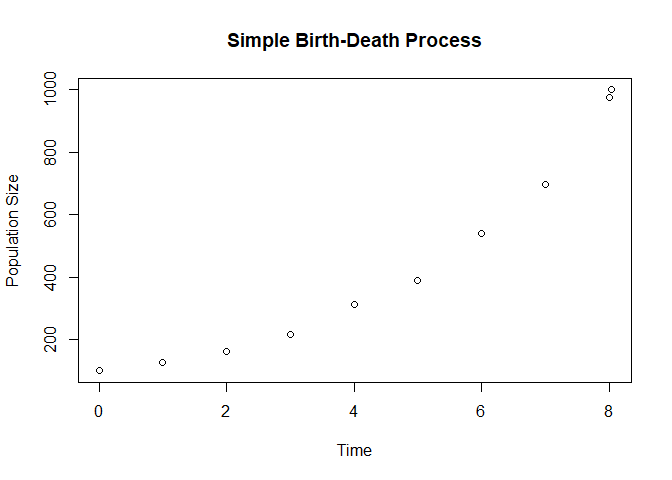
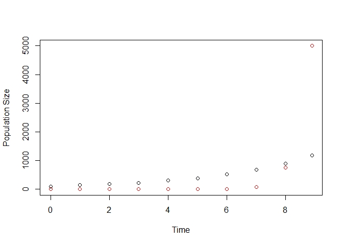
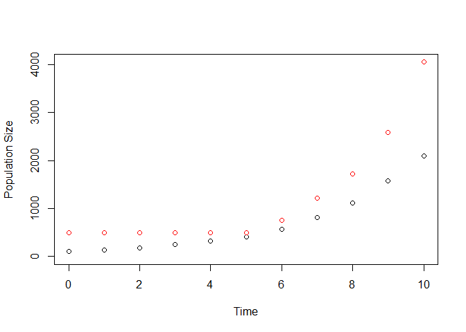
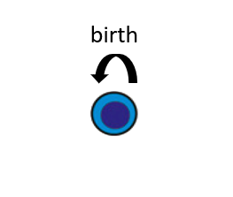
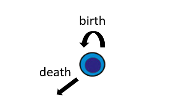
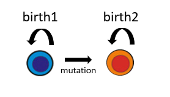
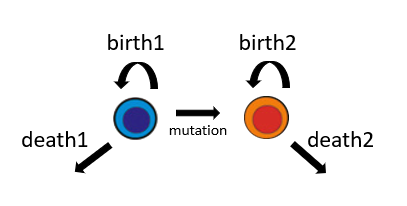
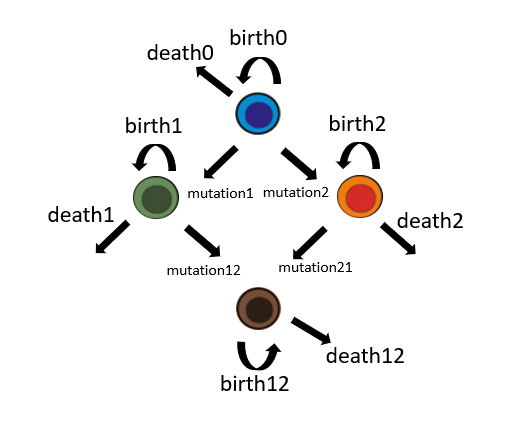

<!-- README.md is generated from README.Rmd. Please edit that file -->
ESTIpop
=======

ESTIpop is an R-wrapped C++ package to simulate general multitype branching processes with time-dependent rates and user-defined offspring distributions and estimate parameters for general multitype branching processes using experimental data.

Dependencies
============

-   [GNU Scientific Library](https://www.gnu.org/software/gsl/)
    -   (OSX) brew install gsl with Homebrew or from [(http://ftpmirror.gnu.org/gsl/)](http://ftpmirror.gnu.org/gsl/).
    -   (Windows) download and extract the file [local\#\#\#.zip](http://www.stats.ox.ac.uk/pub/Rtools/goodies/multilib/) and create an environmental variable LIB\_GSL to add the directory (see notes about Windows installation below for more details).
    -   (Linux) install libgsl0-dev and gsl-bin.
-   [Rtools](https://cran.r-project.org/bin/windows/Rtools/) (Windows only)
-   [devtools](https://github.com/hadley/devtools)

Important notes about Windows installation
==========================================

Rtools contains the necessary resources to compile C++ files when installing packages in R. GSL is also required which can be downloaded from [(http://www.stats.ox.ac.uk/pub/Rtools/goodies/multilib/local323.zip)](http://www.stats.ox.ac.uk/pub/Rtools/goodies/multilib/local323.zip). After downloading, unzip to your R directory. Depending on if your computer is 32 or 64-bit, move the library files from local\#\#\#/lib/i386 (32-bit) or local\#\#\#/lib/x64 (64-bit) to local\#\#\#/lib.

To set the environmental variable LIB\_GSL on a Windows 7/10 computer, go to "Advanced system settings" in Control Panel &gt; System and Security &gt; System and click Environmental Variables. Create a new system variable with

-   Variable Name: LIB\_GSL
-   Variable Value: "C:/path/to/local323" (include quotes)

Recommended R packages
======================

-   igraph
-   ggplot2
-   R.utils

Installation
============

To install in R, type:

``` r
install.packages("devtools")
devtools::install_git("https://github.com/ferlicjl/estipop.git")
```

Uses
====

Estimation
----------

ESTIpop is an R package that uses a likelihood function derived using the Central Limit Theorem applied to general multitype branching processes for the purpose of estimating rate paramters. A general multitype branching process is one in which an individual of each type lives for some random, exponentially-distributed time. At the end of an individual's lifetime, they may generate offspring according to a type-specific, user-defined distribution. The combination of these lifetimes and offspring distribution parameters define rates at which each type of transition is occurring. It is often of interest when modeling a biological system to estimate rates for reactions in the model using experimental data.

Simulation
----------

ESTIpop is an R package that uses C++ to simulate general multitype branching processes and estimate the rate parameters from these models using experimental data. An individual of each type lives for some random, exponentially-distributed time. At the end of an individual's lifetime, they may generate offspring according to a type-specific, user-defined distribution. Also included as part of the package, rates may be time-dependent according to several template functions or completely user specified using C++ plug-ins.

Using ESTIpop in R for Estimation
=================================

General estimation of the rate parameters for general multitype branching processes in ESTIpop can be performed using the estimateBP function with the following parameters. If more specific optimization parameters are needed, we also provide different forms of log-likelihood functions, which can be used with any standard optimizer, which can be optimized to find a maximum likelihood estimator for the rate parameters.

Data
----

Data from which to estimate the rate parameters is supplied to the estimation functions as a matrix, where each rows define the particular observations and columns define the types. Thus, data should be an *N* × *k* matrix for *N* observations and a *k*-type model.

Time
----

Time is a numeric or *N*-length vector of timepoints for each data observation under the assumption that the process was initiated at time 0 with the specified initial vector (see below). If all observations come from the same time point, a single numeric may be used.

Initial Population Vector (N)
-----------------------------

The initial population vector (N) is a *k*-length vector of the type counts at time 0.

TransitionList
--------------

A TransitionList is used to specify the structure of the model by listing the transitions that can occur between the various types. Each transition consists of a parent population, rate, and update vector. The parent population is the population that initiates the transition. The rate is specified in terms of the number of events per individual of the parent type per unit of time and can be constant throughout the course of the simulation or a function of time. The update vector is a *k*-length vector that is added to the system when the transition is enacted after removing one individual from the parent population. For example, in a two-type process, the update vector (2, 0) enacted from parent population 0 would represent the a net increase of 1 in the 0 population. The update vector in estimation for this version of the package must be in the form of a FixedTransition.

### FixedTransition

A FixedTransition is a transition in which the update vector is the fixed across multiple enactments of the same transition. For example, the death and removal of an individual can be represented by the update vector of 0s. Note that whenever a transition is selected to be enacted, an individual from that population is first removed from the system. This is why the constant vector of 0s represents a death event in the parent population.

<table>
<caption>Parameters for a FixedTransition</caption>
<colgroup>
<col width="13%" />
<col width="22%" />
<col width="64%" />
</colgroup>
<thead>
<tr class="header">
<th>Parameter</th>
<th>Variable Type</th>
<th>Description</th>
</tr>
</thead>
<tbody>
<tr class="odd">
<td>parent</td>
<td>integer</td>
<td>specifies which population is capable of enacting this transition</td>
</tr>
<tr class="even">
<td>fixed</td>
<td>integer vector</td>
<td>a <span class="math inline"><em>k</em></span>-length vector that is added to the system</td>
</tr>
</tbody>
</table>

Initial Estimate
----------------

In addition, the user must specify an initial estimate for each rate parameter in the model in the form of a vector.

Known Parameters
----------------

It can sometimes be the case that some parameters have been previously characterized either by previous experimentation or historical literature results. In those cases, it might be necessary to fix a rate paramter to a particular value. This can be accomplished by using the *k**n**o**w**n* parameter. It is a boolean vector the same length as TransitionList object, where *T**R**U**E* designates that the parameter is fixed at the initial estimate value and will not be estimated and *F**A**L**S**E* designates that the rate parameter is to be estimated.

Likelihood Functions
--------------------

As previously mentioned, the estimateBP function will perform optimization on the log-likelihood function derived from the Central Limit Theorem applied to general multitype branching processes. By default, the optimizer will use "L-BFGS-B" method with lower bounds on the rate estimates around 1e-10 and upper bounds around 4. If the user wishes to more finely tune the optimization scheme, we also provide access to the log-likelihood functions, which may be maximized over the rate parameter space to provide a maximum likelihood estimate.

<table>
<caption>ESTIpop likelihood functions</caption>
<colgroup>
<col width="25%" />
<col width="74%" />
</colgroup>
<thead>
<tr class="header">
<th>Function</th>
<th>Usage</th>
</tr>
</thead>
<tbody>
<tr class="odd">
<td>logLik_full</td>
<td>Use when all observations start from same initial states and come from same timepoint. Time parameter is a single numeric and initial is a <span class="math inline"><em>k</em></span>-length vector</td>
</tr>
<tr class="even">
<td>logLik_full_time</td>
<td>Use when all observations start from same initial states, but different timepoints. Time parameter is numeric vector and N is a <span class="math inline"><em>k</em></span> length vector</td>
</tr>
<tr class="odd">
<td>logLik_full_time_piece</td>
<td>Use when observations come from different timepoints with differing initial states. Time parameter is a numeric vector and N will be a matrix.</td>
</tr>
</tbody>
</table>

One-type Birth-Death Example
----------------------------

As an introduction to estimation via ESTIpop, let us start with a one-type birth death model (Figure X). In this model, a population of a single type will experience birth events, in which an individual from the population is chosen to replicate, and death events, in which an individual from the population is chosen for removal. To test our estimation procedure, we will begin by simulating data using functions also available in ESTIpop. We will initiate the population with size 100, let it grow for 5 units of time with birth parameter 1 and death paramter 0.7. We will generate 1000 samples from these process.

``` r
library(estipop)
#> Loading required package: MASS

# Specify how many units of time to simulate
time = 5

# Specify that the simulation will initiate with a single type with size 100
initial = c(100)

# Specify two fixed transitions, birth and death
transitionList = TransitionList(FixedTransition(population = 0, rate = 1.0, fixed = c(2)),
                                FixedTransition(population = 0, rate = 0.7, fixed = c(0)))

# No other stops beyond time
stopList = StopList()

# Simulation 100 trials
ntrials = 100

full_res = matrix(ncol = 2)

# Run simulations and store results into res
for(i in 1:ntrials){
  res = branch(time, initial, transitionList, stopList, silent = TRUE)
  full_res = rbind(full_res, as.matrix(res))
}

full_res = na.omit(full_res)
```

The "full\_res" matrix now contains the size of the population outputted at each integer time for each of the 1000 trials. Here, we will only keep the results from timepoint 5. We can now use this simulated data to try to estimate our birth and death rate parameters.

``` r

# Keep only the population size for timepoint 5
data = as.matrix(full_res[full_res[,1] == 5,2])

# Set up our estimation parameters

N = c(100)

time = 5

transitionList = TransitionList(FixedTransition(population = 0, fixed = c(2)),
                                FixedTransition(population = 0, fixed = c(0)))

initial = c(1, 0.5)

# Estimate using the estimateBP function
estimates = estimateBP(time = time, 
                       N = N, 
                       transitionList = transitionList, 
                       data = data, 
                       initial = initial)
```

The results from estimateBP are those that are returned from the optim function, using the default values from ESTIpop. Let us print out the results.

``` r
# Print the results from the optimizer
print(estimates)
#> $par
#> [1] 0.7837276 0.4793380
#> 
#> $value
#> [1] 491.2492
#> 
#> $counts
#> function gradient 
#>       22       22 
#> 
#> $convergence
#> [1] 0
#> 
#> $message
#> [1] "CONVERGENCE: REL_REDUCTION_OF_F <= FACTR*EPSMCH"
```

Our estimated birth rate is 0.784 and our estimated death rate is 0.479

Two-type Birth-Death-Mutation Example
-------------------------------------

Let us move on to a more complicated, two-type process shown in Figure X. Here, each of the two types has separate birth and death rates, as well a mutation rate from the type 1 population to the type 2 population. We will generate data using one of the simulation methods in ESTIpop. Let us again simulate 1000 samples from this branching process.

``` r
library(estipop)

# Set up matrix to hold full results
full_res = matrix(ncol = 3)

# Set number of trials
ntrials = 100

# Simulate trials and store to full_res
for(i in 1:ntrials){
  data = simBirthDeathMutation(birth1 = 0.4, 
                               death1 = 0.1, 
                               mutation = 0.3, 
                               birth2 = 0.7, 
                               death2 = 0.1, 
                               init = c(100, 0), 
                               time = 1)
  full_res = rbind(full_res, as.matrix(data))
}

# Remove first na row
full_res = na.omit(full_res)

# Get only samples at timepoint 5
data = as.matrix(full_res[full_res[,1] == 1, 2:3])
```

Now let us estimate the rate paramters using this data.

``` r

# Set up our estimation parameters

N = c(100, 0)

time = 1

transitionList = TransitionList(FixedTransition(population = 0, fixed = c(2, 0)),
                                FixedTransition(population = 0, fixed = c(0, 0)),
                                FixedTransition(population = 0, fixed = c(1, 1)),
                                FixedTransition(population = 1, fixed = c(0, 2)),
                                FixedTransition(population = 1, fixed = c(0, 0)))

initial = c(1, 0.4, 0.3, 0.2, 0.1)

estimates = estimateBP(time = time,
                       N = N,
                       transitionList = transitionList,
                       data = data,
                       initial = initial)
```

Again, we can print out our results:

``` r
print(estimates)
#> $par
#> [1] 0.36619223 0.05275426 1.03036211 1.48569457 4.00000000
#> 
#> $value
#> [1] 525.3233
#> 
#> $counts
#> function gradient 
#>       94       94 
#> 
#> $convergence
#> [1] 0
#> 
#> $message
#> [1] "CONVERGENCE: REL_REDUCTION_OF_F <= FACTR*EPSMCH"
```

We can access our point estimates using the 'par' item of the return. We estimate birth1 by 0.366, death1 by 0.053, mutation by 1.03, birth2 by 1.486, and death2 by 4.

Using ESTIpop in R for Simulation
=================================

To simulate a general multitype branching process using ESTIpop will require specifying four main components: (1) simulation time, (2) initial population vector, (3) a TransitionList, and (4) a StopList. While the simulation time and initial population vector are easy to understand, the TransitionList and StopList are unique to ESTIpop for specifying the model structure and simulation stopping criteria. These are passed as arguments to either the branch or branchTD function.

Simulation Time
---------------

Simulation time is the number of time units to run a simulated trajectory. A simulation initiates at time 0 and will output the system population counts at each integer time until until the end time is reached.

Initial Population Vector
-------------------------

The initial population vector is a *k*-length vector of the type counts with which the simulation will begin.

TransitionList
--------------

A TransitionList is used to specify the structure of the model by listing the transitions that can occur between the various types. Each transition consists of a parent population, rate, and update vector. The parent population is the population that initiates the transition. The rate is specified in terms of the number of events per individual of the parent type per unit of time and can be constant throughout the course of the simulation or a function of time. The update vector is a *k*-length vector that is added to the system when the transition is enacted after removing one individual from the parent population. For example, in a two-type process, the update vector (2, 0) enacted from parent population 0 would represent the a net increase of 1 in the 0 population. The update vector may be either fixed or random in nature, demanding the use of either the FixedTransition object or RandomTransition object (see below).

### FixedTransition

A FixedTransition is a transition in which the update vector is the fixed across multiple enactments of the same transition. For example, the death and removal of an individual can be represented by the update vector of 0s. Note that whenever a transition is selected to be enacted, an individual from that population is first removed from the system. This is why the constant vector of 0s represents a death event in the parent population.

<table>
<caption>Parameters for a FixedTransition</caption>
<colgroup>
<col width="13%" />
<col width="22%" />
<col width="64%" />
</colgroup>
<thead>
<tr class="header">
<th>Parameter</th>
<th>Variable Type</th>
<th>Description</th>
</tr>
</thead>
<tbody>
<tr class="odd">
<td>parent</td>
<td>integer</td>
<td>specifies which population is capable of enacting this transition</td>
</tr>
<tr class="even">
<td>rate</td>
<td>numeric or Rate object</td>
<td>specifies the rate per individual per unit time that this transition occurs</td>
</tr>
<tr class="odd">
<td>fixed</td>
<td>integer vector</td>
<td>a <span class="math inline"><em>k</em></span>-length vector that is added to the system</td>
</tr>
</tbody>
</table>

### RandomTransition

A RandomTransition is a transition in which the update vector is determined by draws from random distributions. First, a total number of offspring is drawn from the "oDist" distribution with given parameters "oParams". Then, this number of offspring is distributed to the various types of the system according to a multinomial distribution with probabilities proportional to the "oVec" vector.

<table>
<caption>Parameters for a RandomTransition</caption>
<colgroup>
<col width="13%" />
<col width="22%" />
<col width="64%" />
</colgroup>
<thead>
<tr class="header">
<th>Parameter</th>
<th>Variable Type</th>
<th>Description</th>
</tr>
</thead>
<tbody>
<tr class="odd">
<td>parent</td>
<td>integer</td>
<td>specifies which population is capable of enacting this transition</td>
</tr>
<tr class="even">
<td>rate</td>
<td>numeric or Rate object</td>
<td>specifies the rate per individual per unit time that this transition occurs</td>
</tr>
<tr class="odd">
<td>oDist</td>
<td>string</td>
<td>distribution of the total number of offspring. &quot;poisson&quot;</td>
</tr>
<tr class="even">
<td>oParams</td>
<td>numeric vector</td>
<td>parameters for the oDist offspring distribution</td>
</tr>
<tr class="odd">
<td>oVec</td>
<td>numeric vector</td>
<td>a <span class="math inline"><em>k</em></span>-length vector that specifies probabilities according to which the total offspring will be distributed</td>
</tr>
</tbody>
</table>

### Rates

ESTIpop is capable of simulating general multitype branching processes with both constant transition rates as well as time-dependent transition rates. This can be done by specifying a Rate object as a part of a FixedTransition or RandomTransition. If only a numeric value is given, a constant rate is assumed. To ease the burden of using time-dependent rates, we have provided various templates for common time-dependent structures, although a completely custom function of time may be used.

| Parameter | Variable Type | Description                                             |
|-----------|---------------|---------------------------------------------------------|
| type      | integer       | specifies which Rate template is being used (see below) |
| params    | vector        | specifies parameters for the Rate template (see below)  |

#### Rate Templates

<table>
<caption>Rate Templates</caption>
<colgroup>
<col width="13%" />
<col width="22%" />
<col width="64%" />
</colgroup>
<thead>
<tr class="header">
<th>type</th>
<th>Description</th>
<th>Parameters</th>
</tr>
</thead>
<tbody>
<tr class="odd">
<td>0</td>
<td>Constant Rate</td>
<td>(1) rate per individual per unit time</td>
</tr>
<tr class="even">
<td>1</td>
<td>Linear Rate</td>
<td>(1) intercept and (2) slope of rate function</td>
</tr>
<tr class="odd">
<td>2</td>
<td>Switch Rate</td>
<td>(1) pre-switch rate, (2) post-switch rate, (3) time of switch</td>
</tr>
<tr class="even">
<td>3</td>
<td>Custom Rate</td>
<td>(1) path to dll file and (2) function name within dll</td>
</tr>
</tbody>
</table>

StopList
--------

Similar to a TransitionList, a StopList is a collection of StopCriterion. An alternative to simply simulating for a set length in time, a StopCriterion specifies a certain condition upon which the simulation should halt, such as a particular type reaching a set threshold. After each elemental step in the simulation, all of the specified StopCriterion in the StopList are checked and if any StopCriterion is met, the simulation stops.

### StopCriterion

A StopCriterion is composed of three elements: a set of indices, an inequality, and a value for comparison. During evaluation, the size of each type specified in the set of indices are added together and then compared against the value using the specified inequality. If the statement evalutes true, then the simulation halts.

<table>
<caption>Parameters for a StopCriterion</caption>
<colgroup>
<col width="13%" />
<col width="22%" />
<col width="64%" />
</colgroup>
<thead>
<tr class="header">
<th>Parameter</th>
<th>Variable Type</th>
<th>Description</th>
</tr>
</thead>
<tbody>
<tr class="odd">
<td>indices</td>
<td>integer vector</td>
<td>specifies the set of populations whose sizes should be added together</td>
</tr>
<tr class="even">
<td>inequality</td>
<td>string</td>
<td>one of &quot;&lt;&quot;, &quot;&gt;&quot;, &quot;&lt;=&quot;, &quot;&gt;=&quot; or &quot;=&quot;</td>
</tr>
<tr class="odd">
<td>value</td>
<td>numeric</td>
<td>specifies the value to which the specified system populations will be compareds</td>
</tr>
</tbody>
</table>

Additional Parameters
---------------------

There are three additional parameters that can be optionally specified to simulate.

<table>
<caption>Additional Simulation parameters</caption>
<colgroup>
<col width="13%" />
<col width="22%" />
<col width="64%" />
</colgroup>
<thead>
<tr class="header">
<th>Parameter</th>
<th>Variable Type</th>
<th>Description</th>
</tr>
</thead>
<tbody>
<tr class="odd">
<td>keep</td>
<td>boolean</td>
<td>if true, the temporary comma-separated file generated while simulating while be kept. if false, it will be deleted. Default: false</td>
</tr>
<tr class="even">
<td>silent</td>
<td>boolean</td>
<td>if false, verbose output will be shown. Default: false</td>
</tr>
<tr class="odd">
<td>seed</td>
<td>numeric</td>
<td>specifies a seed for the random number generator</td>
</tr>
</tbody>
</table>

Birth-Death Example
-------------------

Towards learning how to utilize ESTIpop to simulate general multitype branching processes, we present the following birth-death process. Using this simple example as a starting-off point, we will then show how by the addition of relatively few lines, this model can be modified and expanded.

The following script will create the example.

``` r
library(estipop)

# Specify how many units of time to simulate
time = 25

# Specify that the simulation will initiate with a single type with size 100
initial = c(100)

# Specify two fixed transitions, birth and death
transitionList = TransitionList(FixedTransition(population = 0, rate = 1.0, fixed = c(2)),
                                FixedTransition(population = 0, rate = 0.7, fixed = c(0)))

# Sepcify to stop simualtion once the population exceeds 1000
stopList = StopList(StopCriterion(indices = c(0), inequality = ">=", value = 1000))

# Run simulation and store results into res
res = branch(time, initial, transitionList, stopList, silent = TRUE)
```

After installing ESTIpop using the steps outlined above, the library must first be loaded into the current R session. We then begin by specifying how many units of time we wish to simulate. We will simulate for 25 units or until a StopCriterion is reached. We will specify that our initial system state is a single population type with size 100.

We will then add transitions to this population. We will start by adding a birth event, which will occur at a rate of 1.0 events per individual per time unit. We will also add the death event, which will occur at a rate of 0.7 events per individual per time unit. Both of these are fixed transitions and are wrapped by a TransitionList object.

We also specify a StopCriterion that will halt the system simulation when the population exceeds a size of 1,000 individuals.

Lastly, we run the simulation using the branch command as there are no time-dependent rates.

Before expanding our basic process, let us take a look at some of the output files from this simulation. Each simulation is given a unique file prefix and stored in the current working directory. By default, these files are deleted, as the relevant dataframe is returned in the form of an R dataframe. Let's plot the population size over the course of the simulation.

``` r
library(ggplot2)
#> Warning: package 'ggplot2' was built under R version 3.5.1

# Plot the population size of "pop1" vs. simulation
plot(res$time, res$V2, xlab = "Time", ylab = "Population Size", 
      main = "Simple Birth-Death Process")
```



Extending the Birth-Death Example
---------------------------------

In our next example, let us look beyond a simple birth-death process by adding an additional type. In this new model, we will have a parent population which experiences birth and death events. During each birth event, with some probability, there will be a mutation event to a second type. This second type will also have birth and death events. We will assume that the mutation bestows some extremely benefitial functionality to individuals of that type, thus, the growth rate will be many times higher than that of the parental type. We will amend our StopList to halt simulation once either population reaches 5,000.

``` r
library(estipop)

# Specify how many units of time to simulate
time = 25

# Specify that the simulation will initiate with a single type with size 100
initial = c(100, 0)

# Specify some parameters for rates
birth1 = 1.0
death1 = 0.7
mutation1 = 0.005
birth2 = 5
death2 = 3

# Specify two fixed transitions, birth and death
transitionList = TransitionList(FixedTransition(population = 0, rate = birth1 * (1 - mutation1),
                                                fixed = c(2, 0)),
                                FixedTransition(population = 0, rate = death1, 
                                                fixed = c(0, 0)), 
                                FixedTransition(population = 0, rate = birth1 * mutation1, 
                                                fixed = c(1,1)),
                                FixedTransition(population = 1, rate = birth2, 
                                                fixed = c(0, 2)),
                                FixedTransition(population = 1, rate = death2, 
                                                fixed = c(0, 0)))

# Sepcify to stop simualtion once the population exceeds 1000
stopList = StopList(StopCriterion(indices = c(0), inequality = ">=", value = 10000),
                    StopCriterion(indices = c(1), inequality = ">=", value = 10000))

# Run simulation and store results into res
res = branch(time, initial, transitionList, stopList, silent = TRUE)
```

Let us explore some of the output files from this simulation run. First, let us once again start with a plot of the population sizes over time. We expect to see zero population in type 2 until a mutation event from the type 1 population occurs. After this moment, we expect to see rapid growth in this type 2 population.

``` r
# Plot the population size of "pop1" vs. simulation time
plot(res$time, res$V2, col = "black", 
     xlab = "Time", ylab = "Population Size", ylim = c(0, max(res)))
points(res$time, res$V3, col = "red")
```



Time-Dependent Rates
--------------------

We will further extend the previous example to include a time-dependent rate. Here, we will instead initiate the system with 100 type 1 individuals and 500 type 2 individuals. The type 1 individuals will have the same growth patterns as shown in the first example; however, the type 2 individuals will have no growth for the first 5 units of simulation, but will experience slightly increased growth compared to type 1 individuals in subsequent times. We will achieve this by using a Rate template of type 2, which is a switch. Imporantly, because we now are simulating using time-dependent rates, we will use the branchTD simulation function.

``` r
library(estipop)

# Specify how many units of time to simulate
time = 10

# Specify that the simulation will initiate with a single type with size 100
initial = c(100, 500)

# Specify some parameters for rates
birth1 = 1.0
death1 = 0.7
mutation1 = 0.001
birth2 = 1.1
death2 = 0.7

# Specify two fixed transitions, birth and death
transitionList = TransitionList(FixedTransition(population = 0, 
                                                rate = birth1 * (1 - mutation1), 
                                                fixed = c(2, 0)),
                                FixedTransition(population = 0, 
                                                rate = death1, 
                                                fixed = c(0, 0)), 
                                FixedTransition(population = 0, 
                                                rate = birth1 * mutation1, 
                                                fixed = c(1,1)),
                                FixedTransition(population = 1, 
                                                rate = Rate(type = 2, params = c(0, birth2, 5.0)), 
                                                fixed = c(0, 2)),
                                FixedTransition(population = 1, 
                                                rate = Rate(type = 2, params = c(0, death2, 5.0)), 
                                                fixed = c(0, 0)))

# Sepcify to stop simualtion once the population exceeds 1000
stopList = StopList(StopCriterion(indices = c(0), inequality = ">=", value = 10000),
                    StopCriterion(indices = c(1), inequality = ">=", value = 5000))

# Run simulation and store results into res
res = branchTD(time, initial, transitionList, stopList, silent = TRUE)
```

``` r
# Plot the population size of "pop1" vs. simulation time
plot(res$time, res$V2, col = "black", 
     xlab = "Time", ylab = "Population Size", ylim = c(0, max(res)))
points(res$time, res$V3, col = "red")
```



Implemented Models for Quick Simulation
---------------------------------------

As part of the ESTIpop functions, we have included some pre-built simulation functions for some common models.

### One-Type Birth Process - simBirth



| Parameter | Variable Type | Description                         |
|-----------|---------------|-------------------------------------|
| birth     | numeric       | birth rate of individuals           |
| init      | integer       | initial population size             |
| time      | integer       | number of time unites to simulation |

### One-Type Birth-Death Process - simBirthDeath

<p>
<center>

</center>
</p>
| Parameter | Variable Type | Description                         |
|-----------|---------------|-------------------------------------|
| birth     | numeric       | birth rate of individuals           |
| death     | numeric       | death rate of individuals           |
| init      | integer       | initial population size             |
| time      | integer       | number of time unites to simulation |

### Two-Type Birth-Mutation Process - simBirthMutation

<p>
<center>

</center>
</p>
| Parameter | Variable Type  | Description                                |
|-----------|----------------|--------------------------------------------|
| birth1    | numeric        | birth rate of type 1 individuals           |
| birth2    | numeric        | birth rate of type 2 individuals           |
| mutation  | numeric        | mutation rate from type 1 to type 2        |
| init      | integer vector | initial population sizes for types 1 and 2 |
| time      | integer        | number of time unites to simulation        |

### Two-Type Birth-Death-Mutation Process - simBirthDeathMutation

<p>
<center>

</center>
</p>
| Parameter | Variable Type  | Description                                |
|-----------|----------------|--------------------------------------------|
| birth1    | numeric        | birth rate of type 1 individuals           |
| death1    | numeric        | death rate of type 1 individuals           |
| birth2    | numeric        | birth rate of type 2 individuals           |
| death2    | numeric        | death rate of type 2 individuals           |
| mutation  | numeric        | mutation rate from type 1 to type 2        |
| init      | integer vector | initial population sizes for types 1 and 2 |
| time      | integer        | number of time unites to simulation        |

### Two-Type Drug Resistance Model (Four Types) - simTwoTypeResistance

<p>
<center>

</center>
</p>
| Parameter  | Variable Type  | Description                                        |
|------------|----------------|----------------------------------------------------|
| birth0     | numeric        | birth rate of type 0 individuals (no mutation)     |
| death0     | numeric        | death rate of type 0 individuals (no mutation)     |
| birth1     | numeric        | birth rate of type 1 individuals (mutation 1 only) |
| death1     | numeric        | death rate of type 1 individuals (mutation 1 only) |
| birth2     | numeric        | birth rate of type 2 individuals (mutation 2 only) |
| death2     | numeric        | death rate of type 2 individuals (mutation 2 only) |
| birth12    | numeric        | birth rate of type 12 individuals (both mutations) |
| death12    | numeric        | death rate of type 12 individuals (both mutations) |
| mutation1  | numeric        | mutation rate from type 0 to type 1                |
| mutation2  | numeric        | mutation rate from type 0 to type 2                |
| mutation12 | numeric        | mutation rate from type 1 to type 12               |
| mutation21 | numeric        | mutation rate from type 2 to type 12               |
| init       | integer vector | initial population sizes for types 0, 1, 2, 12     |
| time       | integer        | number of time unites to simulation                |
