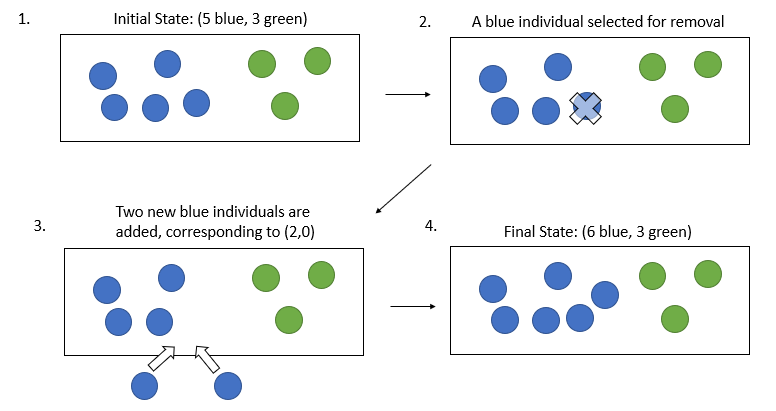

<!-- README.md is generated from README.Rmd. Please edit that file -->
ESTIpop
=======

ESTIpop is an R-wrapped C++ package to simulate general multitype branching processes with time-dependent rates and user-defined offspring distributions and estimate parameters for general multitype branching processes using experimental data.

Dependencies
============

-   [GNU Scientific Library](https://www.gnu.org/software/gsl/)
    -   (OSX) brew install gsl with Homebrew or from [(http://ftpmirror.gnu.org/gsl/)](http://ftpmirror.gnu.org/gsl/).
    -   (Windows) download and extract the file [local\#\#\#.zip](http://www.stats.ox.ac.uk/pub/Rtools/goodies/multilib/) and create an environmental variable LIB\_GSL to add the directory (see notes about Windows installation below for more details).
    -   (Linux) install libgsl0-dev and gsl-bin.
-   [Rtools](https://cran.r-project.org/bin/windows/Rtools/) (Windows only)
-   [devtools](https://github.com/hadley/devtools)

Important notes about Windows installation
==========================================

Rtools contains the necessary resources to compile C++ files when installing packages in R. GSL is also required which can be downloaded from [(http://www.stats.ox.ac.uk/pub/Rtools/goodies/multilib/local323.zip)](http://www.stats.ox.ac.uk/pub/Rtools/goodies/multilib/local323.zip). After downloading, unzip to your R directory. Depending on if your computer is 32 or 64-bit, move the library files from local\#\#\#/lib/i386 (32-bit) or local\#\#\#/lib/x64 (64-bit) to local\#\#\#/lib.

To set the environmental variable LIB\_GSL on a Windows 7/10 computer, go to "Advanced system settings" in Control Panel &gt; System and Security &gt; System and click Environmental Variables. Create a new system variable with

-   Variable Name: LIB\_GSL
-   Variable Value: "C:/path/to/local323" (include quotes)

Recommended R packages
======================

-   igraph
-   ggplot2
-   R.utils

Installation
============

To install in R, type:

``` r
install.packages("devtools")
devtools::install_git("https://github.com/ferlicjl/estipop.git")
```

Uses
====

Estimation
----------

ESTIpop is an R package that uses a likelihood function derived using the Central Limit Theorem applied to continuous-time Markov branching processes (CTMBPs) for the purpose of estimating rate parameters. A CTMBP is a stochastic process in which an individual of each type lives for some random, exponentially-distributed time. At the end of an individual's lifetime, it may generate offspring according to a type-specific distribution. The combination of these lifetimes and offspring distribution parameters define rates at which different types of transitions are occurring. By maximizing the asymptotic likelihood function over the possible paratmer space, rate parameters are estimated.

Simulation
----------

In addition, ESTIpop also provides methods to simulate these continuous-time Markov branching processes using user-defined transitions and rates. Included as part of the package, rates may be time-dependent according to several template functions or completely user specified using C++ plug-ins. Simulation can be a useful tool in combination with estimation to further investigate these biological systems, where differences in model parameterization can lead to various biological outcomes.

Using ESTIpop in R for Estimation
=================================

General estimation of the rate parameters for CTMBPs in ESTIpop can be performed using the `estimateBP` function with parameters described in the next sections. If more specific optimization parameters are needed, we also provide different forms of log-likelihood functions, which can be used with any standard optimizer to find a maximum likelihood estimator for the rate parameters.

Data
----

Data from which to estimate the rate parameters is supplied to the estimation functions as a matrix, where each row is a particular observation of the type counts, which are defined by the columns. Data is provided as an *N* × *k* matrix for *N* observations of a *k*-type system.

Time
----

Time is a numeric or *N*-length vector of timepoints for each data observation under the assumption that the process was initiated at time 0 with the specified initial vector (see below). If all observations come from the same time point, a single numeric may be used.

Initial Population Vector (N)
-----------------------------

The initial population vector (N) is a *k*-length vector of the type counts at time 0.

TransitionList
--------------

A TransitionList is used to specify the structure of the model by listing the transitions that can occur between the various types. Each transition consists of a parent population, rate, and update vector, although for estimation, a rate is not required to be supplied. The parent population is the population that initiates the transition. Populations should be named using 0-indexed integers. The rate is specified in terms of the number of events per individual of the parent type per unit of time and can be constant throughout the course of the simulation. The update vector is a *k*-length vector that is added to the system when the transition is enacted after removing one individual from the parent population enacting that transition.

### FixedTransition

A FixedTransition is a transition in which the update vector is the fixed across multiple enactments of the same transition. As an example, the death and removal of an individual can be represented by using the **0** vector. Whenever a transition is selected to be enacted, an individual from the parent population is first removed from the system. This is why the vector of 0s represents a death event in any type. Table 1 displays the parameters for a FixedTransition.

<table>
<caption>Parameters for a FixedTransition</caption>
<colgroup>
<col width="13%" />
<col width="22%" />
<col width="64%" />
</colgroup>
<thead>
<tr class="header">
<th>Parameter</th>
<th>Variable Type</th>
<th>Description</th>
</tr>
</thead>
<tbody>
<tr class="odd">
<td>parent</td>
<td>integer</td>
<td>specifies which population is capable of enacting this transition</td>
</tr>
<tr class="even">
<td>fixed</td>
<td>integer vector</td>
<td>a <span class="math inline"><em>k</em></span>-length vector that is added to the system</td>
</tr>
</tbody>
</table>

As another example, in a two-type process, the update vector (2, 0) enacted from parent population 0 would represent a net increase of 1 in the 0 population. A single enactment of this FixedTransition is demonstrated in Figure 1.



Figure 1: Example of FIxedTransition(parent = 0 (blue), fixed = c(2, 0)). The blue circles represent indivdiuals of type 0 and the green circles represent individuals of type 1.

Initial Estimate
----------------

In addition, the user must specify an initial estimate for each rate parameter in the model in the form of a vector.

Known Parameters
----------------

It can sometimes be the case that some parameters have been previously characterized either by experimentation or literature results. In those cases, it might be necessary to fix a rate parameter to a particular value. This can be accomplished by using the `known` parameter, which is a boolean vector the same length as the TransitionList object, where `TRUE` designates that the parameter is fixed at the initial estimate value and will not be estimated and, `FALSE` designates that the rate parameter is to be estimated.

Likelihood Functions
--------------------

As previously mentioned, the `estimateBP` function will perform optimization on the log-likelihood function derived from the Central Limit Theorem applied to general multitype branching processes. By default, the optimizer will use the "L-BFGS-B" method (Zhu et al., 1997) with lower bounds on the rate estimates around 1e-10 and upper bounds around 4, which have provided good results for estimating rate parameters for biological processes given in units of number of events per individual per day. If the user wishes to more finely tune the optimization scheme or set differing bounds, we also provide access to the log-likelihood functions, which may be maximized over the rate parameter space to provide a maximum likelihood estimate. The likelihood function, `bploglikelihood` has parameters listed in Table 2.

<table>
<caption><code>bploglikelihood</code> parameters</caption>
<colgroup>
<col width="25%" />
<col width="74%" />
</colgroup>
<thead>
<tr class="header">
<th>Parameter</th>
<th>Usage</th>
</tr>
</thead>
<tbody>
<tr class="odd">
<td>data</td>
<td>A matrix of the type counts, with columns defining the types and each row defining an observation from a particular time point</td>
</tr>
<tr class="even">
<td>time</td>
<td>a numeric or vector of timepoints from which the observed data were collected</td>
</tr>
<tr class="odd">
<td>N</td>
<td>a <span class="math inline"><em>k</em></span>-length vector or matrix of the initial population counts at time 0. If a matrix, each row specifies the initial conditions for the same row in the data matrix</td>
</tr>
<tr class="even">
<td>transitionList</td>
<td>A TransitionList object to specify the model form. See TransitionList.</td>
</tr>
</tbody>
</table>

One-Type Birth-Death Process
----------------------------

As an introduction to estimation via ESTIpop, let us start with the one-type birth-death model shown in Figure 2. In this model, a population of a single type experiences birth events, in which an individual from the population is chosen to replicate, and death events, in which an individual from the population is chosen for removal. To test our estimation procedure, we begin by simulating data using functions available in ESTIpop. We initiate the population with size 100 and allow it expand for 5 units of time with birth parameter 1 and death paramter 0.7. Using the following code, we generate 1,000 samples from this process.

!(images/birthdeath.png)

    Figure 2: One-type birth-death model in which members of the population live for an exponentially-distributed time with parameter $1/(birth+death)$.  At the end of an individual's lifetime, an individual gives birth to two new individuals with probability $birth/(birth+death)$ for a net population increase of 1 and will dies with probability $death/(birth+death)$ for a net population decrease of 1.

``` r
library(estipop)
#> Loading required package: MASS

# Specify how many units of time to simulate
time = 5

# Specify that the simulation will initiate with a single type with size 100
initial = c(100)

# Specify two fixed transitions, birth and death
transitionList = TransitionList(FixedTransition(population = 0, rate = 1.0, fixed = c(2)),
                                FixedTransition(population = 0, rate = 0.7, fixed = c(0)))

# No other stops beyond time
stopList = StopList()

# Simulation 100 trials
ntrials = 1000

full_res = matrix(ncol = 2)

# Run simulations and store results into res
for(i in 1:ntrials){
  res = branch(time, initial, transitionList, stopList, silent = TRUE)
  full_res = rbind(full_res, as.matrix(res))
}

full_res = na.omit(full_res)
```

The "full\_res" matrix now contains the size of the population output at each integer time for each of the 1,000 trials. Here, we only retain the results from timepoint 5. We can now use this simulated data to estimate the birth and death rate parameters. The following code performs the desired estimation.

``` r

# Keep only the population size for timepoint 5
data = as.matrix(full_res[full_res[,1] == 5,2])

# Set up our estimation parameters

N = c(100)

time = 5

transitionList = TransitionList(FixedTransition(population = 0, fixed = c(2)),
                                FixedTransition(population = 0, fixed = c(0)))

initial = c(1, 0.5)

# Estimate using the estimateBP function
estimates = estimateBP(time = time, 
                       N = N, 
                       transitionList = transitionList, 
                       data = data, 
                       initial = initial)
```

The results from `estimateBP` are those that are returned from the optim function, using the default values from ESTIpop. Let us print out the results.

``` r
# Print the results from the optimizer
print(estimates)
#> $par
#> [1] 1.0702261 0.7701298
#> 
#> $value
#> [1] 5083.622
#> 
#> $counts
#> function gradient 
#>       31       31 
#> 
#> $convergence
#> [1] 0
#> 
#> $message
#> [1] "CONVERGENCE: REL_REDUCTION_OF_F <= FACTR*EPSMCH"
```

Our estimated birth rate is 1.07 and our estimated death rate is 0.77. Our true birth rate parameter is 1.0 and our true death rate parameter is 0.7. These estimated results differ slightly from the true values and repeating this procedure with new simulated data results in different estimates, akin to a sampling distribution.

Two-Type Birth-Death-Mutation Process
-------------------------------------

Let us move on to a more complicated process, the two-type process shown in Figure 3. Here, each of the two population types has separate birth and death rates, as well a mutation rate from the type 1 population to the type 2 population. We generate data using one of the `simBirthDeathMutation` simulation method in ESTIpop. Let us again simulate 1000 samples from this branching process using the following code.

Figure 3: Two-type birth-death-mutation model. Each type has its own birth and death rate parameters in addition to a mutation event from type 1 to type 2.

``` r
library(estipop)

# Set up matrix to hold full results
full_res = matrix(ncol = 3)

# Set number of trials
ntrials = 1000

# Simulate trials and store to full_res
for(i in 1:ntrials){
  data = simBirthDeathMutation(birth1 = 0.4, 
                               death1 = 0.1, 
                               mutation = 0.3, 
                               birth2 = 0.7, 
                               death2 = 0.1, 
                               init = c(100, 0), 
                               time = 1)
  full_res = rbind(full_res, as.matrix(data))
}

# Remove first na row
full_res = na.omit(full_res)

# Get only samples at timepoint 5
data = as.matrix(full_res[full_res[,1] == 1, 2:3])
```

Now let us estimate the rate paramters using this data.

``` r

# Set up our estimation parameters

N = c(100, 0)

time = 1

transitionList = TransitionList(FixedTransition(population = 0, fixed = c(2, 0)),
                                FixedTransition(population = 0, fixed = c(0, 0)),
                                FixedTransition(population = 0, fixed = c(1, 1)),
                                FixedTransition(population = 1, fixed = c(0, 2)),
                                FixedTransition(population = 1, fixed = c(0, 0)))

initial = c(1, 0.4, 0.3, 0.2, 0.1)

estimates = estimateBP(time = time,
                       N = N,
                       transitionList = transitionList,
                       data = data,
                       initial = initial)
```

Again, we print out our resulting estimates:

``` r
print(estimates)
#> $par
#> [1] 0.4069505 0.1096858 0.2965296 0.7007437 0.0639363
#> 
#> $value
#> [1] 5461.758
#> 
#> $counts
#> function gradient 
#>       37       37 
#> 
#> $convergence
#> [1] 0
#> 
#> $message
#> [1] "CONVERGENCE: REL_REDUCTION_OF_F <= FACTR*EPSMCH"
```

We can access our point estimates using the 'par' item of the return. We estimate birth1 as 0.407, death1 as 0.11, mutation as 0.297, birth2 as 0.701, and death2 as 0.064. Our true birth1 rate is 0.4, our true death1 rate is 0.1, our true mutation rate is 0.3, our true birth2 rate is 0.7, and our true death2 rate is 0.1. Again, the results from our estimation represent the result of estimating based on a single sample of size 1,000, meaning that if we repeat the simulation and estimation, we arrive at different results.

Using ESTIpop in R for Simulation
=================================

To simulate a general multitype branching process using ESTIpop requires specifying four main components: (1) simulation time, (2) initial population vector, (3) a TransitionList, and (4) a StopList. While the simulation time and initial population vector are easy to understand, the TransitionList and StopList are unique to ESTIpop for specifying the model structure and simulation stopping criteria. These are passed as arguments to either the `branch` or `branchTD` function.

Simulation Time
---------------

Simulation time is the number of time units for which a simulated trajectory is run. A simulation initiates at time 0 and outputs the system population counts at each integer time until the end time is reached.

Initial Population Vector
-------------------------

The initial population vector is a *k*-length vector of the type counts with which the simulation begins.

TransitionList
--------------

A TransitionList is used to specify the structure of the model by listing the transitions that can occur between the various types. Each transition consists of a parent population, rate, and update vector, although for estimation, a rate is not required to be supplied. The parent population is the population that initiates the transition. Populations should be named using 0-indexed integers. The rate is specified in terms of the number of events per individual of the parent type per unit of time and can be constant throughout the course of the simulation. The update vector is a *k*-length vector that is added to the system when the transition is enacted after removing one individual from the parent population enacting that transition. The update vector may be either fixed or random in nature, demanding the use of either the FixedTransition object or RandomTransition object (see FixedTransition and RandomTransition).

### FixedTransition

A FixedTransition is a transition in which the update vector is the fixed across multiple enactments of the same transition. As an example, the death and removal of an individual can be represented by using the **0** vector. Whenever a transition is selected to be enacted, an individual from the parent population is first removed from the system. This is why the vector of 0s represents a death event in any type. Table 3 displays the parameters for a FixedTransition.

<table>
<caption>Parameters for a FixedTransition</caption>
<colgroup>
<col width="13%" />
<col width="22%" />
<col width="64%" />
</colgroup>
<thead>
<tr class="header">
<th>Parameter</th>
<th>Variable Type</th>
<th>Description</th>
</tr>
</thead>
<tbody>
<tr class="odd">
<td>parent</td>
<td>integer</td>
<td>specifies which population is capable of enacting this transition</td>
</tr>
<tr class="even">
<td>rate</td>
<td>numeric or Rate object</td>
<td>specifies the rate per individual per unit time that this transition occurs</td>
</tr>
<tr class="odd">
<td>fixed</td>
<td>integer vector</td>
<td>a <span class="math inline"><em>k</em></span>-length vector that is added to the system</td>
</tr>
</tbody>
</table>

### RandomTransition

A RandomTransition is a transition in which the update vector is determined by draws from a random distribution. First, a total number of offspring is drawn from the `oDist` distribution with given parameters `oParams`. Then, this number of offspring is distributed to the various types of the system according to a multinomial distribution with probabilities proportional to the `oVec` vector. The parameters for a RandomTransition are shown in Table 4.

<table>
<caption>Parameters for a RandomTransition</caption>
<colgroup>
<col width="13%" />
<col width="22%" />
<col width="64%" />
</colgroup>
<thead>
<tr class="header">
<th>Parameter</th>
<th>Variable Type</th>
<th>Description</th>
</tr>
</thead>
<tbody>
<tr class="odd">
<td>parent</td>
<td>integer</td>
<td>specifies which population is capable of enacting this transition</td>
</tr>
<tr class="even">
<td>rate</td>
<td>numeric or Rate object</td>
<td>specifies the rate per individual per unit time that this transition occurs</td>
</tr>
<tr class="odd">
<td>oDist</td>
<td>string</td>
<td>distribution of the total number of offspring. &quot;poisson&quot;</td>
</tr>
<tr class="even">
<td>oParams</td>
<td>numeric vector</td>
<td>parameters for the oDist offspring distribution</td>
</tr>
<tr class="odd">
<td>oVec</td>
<td>numeric vector</td>
<td>a <span class="math inline"><em>k</em></span>-length vector that specifies probabilities according to which the total offspring will be distributed</td>
</tr>
</tbody>
</table>

### Rates

ESTIpop is capable of simulating general multitype branching processes with both constant transition rates as well as time-dependent transition rates. This can be done by specifying a Rate object as a part of a FixedTransition or RandomTransition. If only a numeric value is given, a constant rate is assumed. To ease the burden of using time-dependent rates, we have provided various templates for common time-dependent structures, although a completely custom function of time may also be used. If a time-dependent rate is used, the appropriate simulation function is `branchTD`. The parameters for a Rate are shown in Table 5.

| Parameter | Variable Type | Description                                             |
|-----------|---------------|---------------------------------------------------------|
| type      | integer       | specifies which rate template is being used (see below) |
| params    | vector        | specifies parameters for the Rate template (see below)  |

#### Rate Templates

Rate templates have been included in ESTIpop to provide access to common time-dependent rates. Each is specific using the `type` parameter of a Rate and the accompanying parameters. The templates and their parameters are shown in Table 6.

<table>
<caption>Rate Templates</caption>
<colgroup>
<col width="13%" />
<col width="22%" />
<col width="64%" />
</colgroup>
<thead>
<tr class="header">
<th>type</th>
<th>Description</th>
<th>Parameters</th>
</tr>
</thead>
<tbody>
<tr class="odd">
<td>0</td>
<td>Constant Rate</td>
<td>(i) rate per individual per unit time</td>
</tr>
<tr class="even">
<td>1</td>
<td>Linear Rate</td>
<td>(i) intercept and (ii) slope of rate function</td>
</tr>
<tr class="odd">
<td>2</td>
<td>Switch Rate</td>
<td>(i) pre-switch rate, (ii) post-switch rate, (iii) time of switch</td>
</tr>
<tr class="even">
<td>3</td>
<td>Custom Rate</td>
<td>(i) path to dll file and (ii) function name within dll</td>
</tr>
</tbody>
</table>

#### Custom Rates

ESTIpop provides methods so that users may use C++ to implement their own time-dependent rates for use in simulation. To get started, use the `create_timedep_template` function. The parameter for this function is the name of a C++ source (.cpp) file. If no other location is specified, this file will be created in the current working directory. In addition, a header file (.h) with the same filename will be created. In the source (.cpp) file, an example time-dependent rate function is implemented. Additional functions may be added by copying the template function and changing the function name. If any additional rate functions are implemented, their function declarations must be added to the header (.h) file, which can be done by copying the `double rate(double time, void* p);` line and changing the function name.

After the function is implemented, it must be compiled using the `compile_timedep` function using the same argument used in the creation of the template. If compilation is successful, this will create a shared library (.dll) file. This is the file that is used as the first parameter in the custom rate template. The second parameter is the function name.

StopList
--------

Similar to a TransitionList, a StopList is a collection of StopCriteria. An alternative to simply simulating a process for a set length in time, a StopCriterion specifies a certain condition upon which the simulation should halt, such as a particular type reaching a set threshold. After each elementary step in the simulation, all of the specified StopCriteria in the StopList are checked and if any StopCriterion is met, the simulation stops.

### StopCriteria

A StopCriterion is composed of three elements: a set of indices, an inequality, and a value for comparison. During evaluation, the size of each type specified in the set of indices are added together and then compared against the value using the specified inequality. If the statement evaluates true, then the simulation halts. The parameters for a StopCriterion are shown in Table 7.

<table>
<caption>Parameters for a StopCriterion</caption>
<colgroup>
<col width="13%" />
<col width="22%" />
<col width="64%" />
</colgroup>
<thead>
<tr class="header">
<th>Parameter</th>
<th>Variable Type</th>
<th>Description</th>
</tr>
</thead>
<tbody>
<tr class="odd">
<td>indices</td>
<td>integer vector</td>
<td>specifies the set of populations whose sizes should be added</td>
</tr>
<tr class="even">
<td>inequality</td>
<td>string</td>
<td>one of &quot;&lt;&quot;, &quot;&gt;&quot;, &quot;&lt;=&quot;, &quot;&gt;=&quot; or &quot;=&quot;</td>
</tr>
<tr class="odd">
<td>value</td>
<td>numeric</td>
<td>specifies the value to which the specified system populations will be compared</td>
</tr>
</tbody>
</table>

Additional Parameters
---------------------

Additional simulation parameters that can be optionally specified are shown in Table 8.

<table>
<caption>Additional Simulation parameters</caption>
<colgroup>
<col width="13%" />
<col width="22%" />
<col width="64%" />
</colgroup>
<thead>
<tr class="header">
<th>Parameter</th>
<th>Variable Type</th>
<th>Description</th>
</tr>
</thead>
<tbody>
<tr class="odd">
<td>keep</td>
<td>boolean</td>
<td>if <code>TRUE</code>, the temporary comma-separated file generated while simulating is kept. if <code>FALSE</code>, it is deleted. Default: <code>FALSE</code></td>
</tr>
<tr class="even">
<td>silent</td>
<td>boolean</td>
<td>if <code>FALSE</code>, verbose output is shown. Default: <code>FALSE</code></td>
</tr>
<tr class="odd">
<td>seed</td>
<td>numeric</td>
<td>specifies a seed for the random number generator</td>
</tr>
<tr class="even">
<td>approx</td>
<td>boolean</td>
<td>if <code>TRUE</code>, approximate simulation is used, if <code>FALSE</code>, exact simulation is performed. Can only be used in <code>branch</code> function. Default: <code>FALSE</code></td>
</tr>
</tbody>
</table>

Birth-Death Example
-------------------

To demonstrate how to utilize ESTIpop to simulate general multitype branching processes, we present the following birth-death process. Using this simple example as a starting point, we then show how, by the addition of relatively few lines, this model can be modified and expanded. The birth-death process consists of a population of a single type whose population expands or declines according to the specified birth and death rate parameters. A pictoral representation of the birth-death process is shown in Figure 2.

The following script will create the example.

``` r
library(estipop)

# Specify how many units of time to simulate
time = 25

# Specify that the simulation will initiate with a single type with size 100
initial = c(100)

# Specify two fixed transitions, birth and death
transitionList = TransitionList(FixedTransition(population = 0, rate = 1.0, fixed = c(2)),
                                FixedTransition(population = 0, rate = 0.7, fixed = c(0)))

# Sepcify to stop simualtion once the population exceeds 1000
stopList = StopList(StopCriterion(indices = c(0), inequality = ">=", value = 1000))

# Run simulation and store results into res
res = branch(time, initial, transitionList, stopList, silent = TRUE)
```

After installing ESTIpop using the steps outlined above, the library must first be loaded into the current R session. We then begin by specifying how many units of time we wish to simulate. As an example, we simulate this process for 25 units or until a StopCriterion is reached. We specify that our initial system state is a single population type with size 100.

We then add transitions to this population. We start by adding a birth event, which occurs at a rate of 1.0 events per individual per time unit. We also add the death events, which occur at a rate of 0.7 events per individual per time unit. Both of these are fixed transitions and are wrapped by a TransitionList object. We also specify a StopCriterion that halts the system simulation when the population exceeds a size of 1,000 individuals.

Lastly, we run the simulation using the `branch` function as there are no time-dependent rates.

Before expanding our basic process, let us take a look at some of the output files from this simulation. Each simulation is given a unique file prefix and stored in the current working directory. By default, these files are deleted, as the relevant dataframe is returned in the form of an R dataframe. To plot the population size over the course of the simulation we use the following code:

``` r
# Plot the population size of "pop1" vs. simulation
plot(res$time, res$V2, xlab = "Time", ylab = "Population Size", 
      main = "Simple Birth-Death Process")
```

The resulting plot is shown in Figure 4.

Figure 4: Population size of a one-type birth-death process shown over time. The birth rate is 1.0 events per indivdiual per time unit and the death rate is 0.7 events per individual per time unit.

Extending the Birth-Death Process
---------------------------------

In our next example, let us look beyond a simple birth-death process by adding an additional cell type. In this new model, there is a parent population, called type 1, which experiences birth and death events. During each birth event, with some probability, a mutation event occurs that gives rise to a second type, type 2. This second type also has birth and death events. We assume that the mutation bestows some extremely benefitial functionality to individuals of that type, and thus the growth rate of this type will be many times higher than that of the parental type. We amend our StopList to halt the simulation once either population reaches 5,000. To this end, we use the following code:

``` r
library(estipop)

# Specify how many units of time to simulate
time = 25

# Specify that the simulation will initiate with a single type with size 100
initial = c(100, 0)

# Specify some parameters for rates
birth1 = 1.0
death1 = 0.7
mutation1 = 0.001
birth2 = 5
death2 = 3

# Specify two fixed transitions, birth and death
transitionList = TransitionList(FixedTransition(population = 0, rate = birth1 * (1 - mutation1),
                                                fixed = c(2, 0)),
                                FixedTransition(population = 0, rate = death1, 
                                                fixed = c(0, 0)), 
                                FixedTransition(population = 0, rate = birth1 * mutation1, 
                                                fixed = c(1,1)),
                                FixedTransition(population = 1, rate = birth2, 
                                                fixed = c(0, 2)),
                                FixedTransition(population = 1, rate = death2, 
                                                fixed = c(0, 0)))

# Sepcify to stop simualtion once the population exceeds 1000
stopList = StopList(StopCriterion(indices = c(0), inequality = ">=", value = 5000),
                    StopCriterion(indices = c(1), inequality = ">=", value = 5000))

# Run simulation and store results into res
res = branch(time, initial, transitionList, stopList, silent = TRUE)
```

Let us explore some of the output files from this simulation run. First, let us once again start with a plot of the population sizes over time. We expect to see zero cells of type 2 until a mutation event from the type 1 population occurs. After this moment, we expect to see rapid growth of this type 2 population.

``` r
# Plot the population size of "pop1" vs. simulation time
plot(res$time, res$V2, col = "black", 
     xlab = "Time", ylab = "Population Size", ylim = c(0, max(res)))
points(res$time, res$V3, col = "red")
```

Figure 5: Population size of a two-type birth-death-mutation process shown over time. The first population (black circles) grows according to its birth and death parameters. The second population (red circles) remains at 0 until a mutation event generates one individual, at which time the population experiences tremendous growth.

Time-Dependent Rates
--------------------

We now further extend the previous example to include a time-dependent rate. Here, we initiate the system with 100 type 1 individuals and 500 type 2 individuals. The type 1 individuals have the same growth patterns as shown in the first example; however, the type 2 individuals do not grow for the first 5 units of simulation, but experience slightly increased growth compared to type 1 individuals in subsequent times. We perform this simulation by using a Rate template of type 2, which designates a switch, where the rate is one value before the switch time and another value after the switch time. Imporantly, because we now are simulating using time-dependent rates, we use the `branchTD` simulation function. We use the following code;

``` r
library(estipop)

# Specify how many units of time to simulate
time = 10

# Specify that the simulation will initiate with a single type with size 100
initial = c(100, 500)

# Specify some parameters for rates
birth1 = 1.0
death1 = 0.7
mutation1 = 0.001
birth2 = 1.1
death2 = 0.7

# Specify two fixed transitions, birth and death
transitionList = TransitionList(FixedTransition(population = 0, 
                                                rate = birth1 * (1 - mutation1), 
                                                fixed = c(2, 0)),
                                FixedTransition(population = 0, 
                                                rate = death1, 
                                                fixed = c(0, 0)), 
                                FixedTransition(population = 0, 
                                                rate = birth1 * mutation1, 
                                                fixed = c(1,1)),
                                FixedTransition(population = 1, 
                                                rate = Rate(type = 2, 
                                                            params = c(0, birth2, 5.0)), 
                                                fixed = c(0, 2)),
                                FixedTransition(population = 1, 
                                                rate = Rate(type = 2, 
                                                            params = c(0, death2, 5.0)), 
                                                fixed = c(0, 0)))

# Sepcify to stop simualtion once the population exceeds 1000
stopList = StopList(StopCriterion(indices = c(0), inequality = ">=", value = 10000),
                    StopCriterion(indices = c(1), inequality = ">=", value = 5000))

# Run simulation and store results into res
res = branchTD(time, initial, transitionList, stopList, silent = TRUE)
```

``` r
# Plot the population size of "pop1" vs. simulation time
plot(res$time, res$V2, col = "black", 
     xlab = "Time", ylab = "Population Size", ylim = c(0, max(res)))
points(res$time, res$V3, col = "red")
```

The resulting plot is shown in Figure 6, where the type 2 population remains constant for 5 units of time according to the switch rate, and then experiences growth following time unit 5.

Figure 6: Population size of a two-type birth-death-mutation process shown over time. The first population (black circles) grows according to its birth and death parameters. The second population (red circles) remains at its initial value of 500 for 5 units of time and then experiences growth thereafter.

Model Implementation for Quick Simulation
-----------------------------------------

As part of the ESTIpop functions, we have included some pre-built simulation functions for some common models.

### One-Type Birth Process - `simBirth`

The one-type birth process is a one-type process. Birth events have the effect of adding an additional individual to the population. The birth process is shown in Figure 7 and the `simBirth` function parameters are shown in Table 9.

Figure 7: The birth process is a one-type process with birth events.

<table>
<caption>Parameters for <code>simBirth</code></caption>
<colgroup>
<col width="13%" />
<col width="22%" />
<col width="64%" />
</colgroup>
<thead>
<tr class="header">
<th>Parameter</th>
<th>Variable Type</th>
<th>Description</th>
</tr>
</thead>
<tbody>
<tr class="odd">
<td>birth</td>
<td>numeric</td>
<td>birth rate of individuals</td>
</tr>
<tr class="even">
<td>init</td>
<td>integer</td>
<td>initial population size</td>
</tr>
<tr class="odd">
<td>time</td>
<td>integer</td>
<td>number of time unites to simulation</td>
</tr>
<tr class="even">
<td>approx</td>
<td>boolean</td>
<td>flag to use approximate simulation (<code>TRUE</code>) or exact simulation (<code>FALSE</code>)</td>
</tr>
</tbody>
</table>

### One-Type Birth-Death Process - `simBirthDeath`

The one-type birth-death process is a one-type process, in which the population experiences both birth and death. The birth-death process is shown in Figure 8 and the `simBirthDeath` function parameters are shown in Table 10.

Figure 8: The birth-death process is a one-type process with birth and death events.

<table>
<caption>Parameters for <code>simBirthDeath</code></caption>
<colgroup>
<col width="13%" />
<col width="22%" />
<col width="64%" />
</colgroup>
<thead>
<tr class="header">
<th>Parameter</th>
<th>Variable Type</th>
<th>Description</th>
</tr>
</thead>
<tbody>
<tr class="odd">
<td>birth</td>
<td>numeric</td>
<td>birth rate of individuals</td>
</tr>
<tr class="even">
<td>death</td>
<td>numeric</td>
<td>death rate of individuals</td>
</tr>
<tr class="odd">
<td>init</td>
<td>integer</td>
<td>initial population size</td>
</tr>
<tr class="even">
<td>time</td>
<td>integer</td>
<td>number of time unites to simulation</td>
</tr>
<tr class="odd">
<td>approx</td>
<td>boolean</td>
<td>flag to use approximate simulation (<code>TRUE</code>) or exact simulation (<code>FALSE</code>)</td>
</tr>
</tbody>
</table>

### Two-Type Birth-Mutation Process - `simBirthMutation`

The birth-mutation process is a two-type process, in which each population type experiences birth events, as well a mutation event occuring between the first type and the second type. The birth-mutation process is shown in Figure 9 and the `simBirthMutation` function parameters are shown in Table 11.

Figure 9: The birth-mutation process is a two-type process with birth events for both types and a mutation event from type 1 (blue cells) to type 2 (red cells).

<table>
<caption>Parameters for <code>simBirthMutation</code></caption>
<colgroup>
<col width="13%" />
<col width="22%" />
<col width="64%" />
</colgroup>
<thead>
<tr class="header">
<th>Parameter</th>
<th>Variable Type</th>
<th>Description</th>
</tr>
</thead>
<tbody>
<tr class="odd">
<td>birth1</td>
<td>numeric</td>
<td>birth rate of type 1 individuals</td>
</tr>
<tr class="even">
<td>birth2</td>
<td>numeric</td>
<td>birth rate of type 2 individuals</td>
</tr>
<tr class="odd">
<td>mutation</td>
<td>numeric</td>
<td>mutation rate from type 1 to type 2</td>
</tr>
<tr class="even">
<td>init</td>
<td>integer vector</td>
<td>initial population sizes for types 1 and 2</td>
</tr>
<tr class="odd">
<td>time</td>
<td>integer</td>
<td>number of time unites to simulation</td>
</tr>
<tr class="even">
<td>approx</td>
<td>boolean</td>
<td>flag to use approximate simulation (<code>TRUE</code>) or exact simulation (<code>FALSE</code>)</td>
</tr>
</tbody>
</table>

### Two-Type Birth-Death-Mutation Process - `simBirthDeathMutation`

The birth-death-mutation process is a two-type process, in which each population type experiences birth and death events, as well a mutation event occuring between the first type and the second type. The birth-mutation process is shown in Figure 10 and the `simBirthDeathMutation` function parameters are shown in Table 12.

Figure 10: The birth-death-mutation process is a two-type process with birth and death events for both types and a mutation event from type 1 (blue cells) to type 2 (red cells).

<table>
<caption>Parameters for <code>simBirthDeathMutation</code></caption>
<colgroup>
<col width="13%" />
<col width="22%" />
<col width="64%" />
</colgroup>
<thead>
<tr class="header">
<th>Parameter</th>
<th>Variable Type</th>
<th>Description</th>
</tr>
</thead>
<tbody>
<tr class="odd">
<td>birth1</td>
<td>numeric</td>
<td>birth rate of type 1 individuals</td>
</tr>
<tr class="even">
<td>death1</td>
<td>numeric</td>
<td>death rate of type 1 individuals</td>
</tr>
<tr class="odd">
<td>birth2</td>
<td>numeric</td>
<td>birth rate of type 2 individuals</td>
</tr>
<tr class="even">
<td>death2</td>
<td>numeric</td>
<td>death rate of type 2 individuals</td>
</tr>
<tr class="odd">
<td>mutation</td>
<td>numeric</td>
<td>mutation rate from type 1 to type 2</td>
</tr>
<tr class="even">
<td>init</td>
<td>integer vector</td>
<td>initial population sizes for types 1 and 2</td>
</tr>
<tr class="odd">
<td>time</td>
<td>integer</td>
<td>number of time unites to simulation</td>
</tr>
<tr class="even">
<td>approx</td>
<td>boolean</td>
<td>flag to use approximate simulation (<code>TRUE</code>) or exact simulation (<code>FALSE</code>)</td>
</tr>
</tbody>
</table>

### Two-Type Drug Resistance Model (Four Types) - `simTwoTypeResistance`

The two-type drug resistance model is a four-type process in which two types of mutation are possible. The type 0 population harbors no mutations, the type 1 population harbors mutation 1, the type 2 population harbors mutation 2, and the type 12 population harbors both mutations 1 and 2. Each type undergoes birth and death events, as well as the possibily for further mutation. The two-type drug resistance model is shown in Figure 11 and the `simTwoTypeResistance` function parameters are shown in Table 13.

Figure 11: The two-type drug resistance model is a four-type process in which two types of mutation are possible. The type 0 population (blue cells) harbors no mutations, the type 1 population (green cells) harbors mutation 1, the type 2 population (red cells) harbors mutation 2, and the type 12 population (brown cells) harbors both mutations 1 and 2. Each type undergoes birth and death events, as well as the possibily for further mutation.

<table>
<caption>Parameters for <code>simTwoTypeResistance</code></caption>
<colgroup>
<col width="13%" />
<col width="22%" />
<col width="64%" />
</colgroup>
<thead>
<tr class="header">
<th>Parameter</th>
<th>Variable Type</th>
<th>Description</th>
</tr>
</thead>
<tbody>
<tr class="odd">
<td>birth0</td>
<td>numeric</td>
<td>birth rate of type 0 individuals (no mutation)</td>
</tr>
<tr class="even">
<td>death0</td>
<td>numeric</td>
<td>death rate of type 0 individuals (no mutation)</td>
</tr>
<tr class="odd">
<td>birth1</td>
<td>numeric</td>
<td>birth rate of type 1 individuals (mutation 1 only)</td>
</tr>
<tr class="even">
<td>death1</td>
<td>numeric</td>
<td>death rate of type 1 individuals (mutation 1 only)</td>
</tr>
<tr class="odd">
<td>birth2</td>
<td>numeric</td>
<td>birth rate of type 2 individuals (mutation 2 only)</td>
</tr>
<tr class="even">
<td>death2</td>
<td>numeric</td>
<td>death rate of type 2 individuals (mutation 2 only)</td>
</tr>
<tr class="odd">
<td>birth12</td>
<td>numeric</td>
<td>birth rate of type 12 individuals (both mutations)</td>
</tr>
<tr class="even">
<td>death12</td>
<td>numeric</td>
<td>death rate of type 12 individuals (both mutations)</td>
</tr>
<tr class="odd">
<td>mutation1</td>
<td>numeric</td>
<td>mutation rate from type 0 to type 1</td>
</tr>
<tr class="even">
<td>mutation2</td>
<td>numeric</td>
<td>mutation rate from type 0 to type 2</td>
</tr>
<tr class="odd">
<td>mutation12</td>
<td>numeric</td>
<td>mutation rate from type 1 to type 12</td>
</tr>
<tr class="even">
<td>mutation21</td>
<td>numeric</td>
<td>mutation rate from type 2 to type 12</td>
</tr>
<tr class="odd">
<td>init</td>
<td>integer vector</td>
<td>initial population sizes for types 0, 1, 2, 12</td>
</tr>
<tr class="even">
<td>time</td>
<td>integer</td>
<td>number of time unites to simulation</td>
</tr>
<tr class="odd">
<td>approx</td>
<td>boolean</td>
<td>flag to use approximate simulation (<code>TRUE</code>) or exact simulation (<code>FALSE</code>)</td>
</tr>
</tbody>
</table>

Zhu, C., Byrd, R. H., Lu, P., & Nocedal, J. (1997). Algorithm 778: L-BFGS-B: Fortran subroutines for large-scale bound-constrained optimization. ACM Transactions on Mathematical Software (TOMS), 23(4), 550-560.
